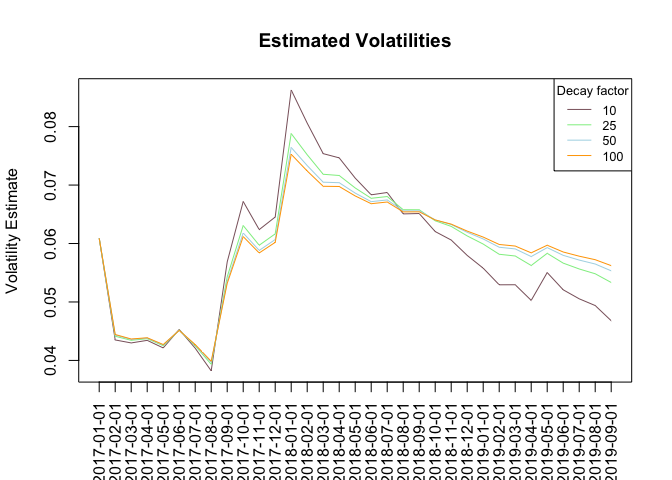

#### The Stock: Walmart

Walmart (ticker symbol: WMT) trades on the NYSE. Walmart is the largest retailer in the world, serving nearly 265 million customers in more than 11,200 stores in 27 countries. 

#### Download the Data 


#### Calculate the log returns

```r
WMTreturn <- log(lag(WMTdata)) - log(WMTdata)
#cut series to show 2017,2018,2019
WMTreturn <- WMTreturn[grep("2017|2018|2019",time(WMTreturn))]
#how many retuns do we have?
dates <- time(WMTreturn)
length(WMTreturn)
```

```
## [1] 33
```
There are 33 return data points. 

#### Calculate volatility measure 

```r
#250 is number of trading days/year
WMTvol <- sd(WMTreturn)*sqrt(250)*100
WMTvol
```

```
## [1] 87.07764
```
Current volatility is 87.0776377

#### Calculate volatility over entire length of series for the different decay factors

```r
#Volatility Function
#Calculates a list of volatilities for all stock returns in a list
vol <- function(d, logrets){
  var=0
  lam=0
  varlist<- c()
  for (r in logrets){
    lam=lam*(1-1/d) +1
  var = (1 - 1/lam)*var + (1/lam)*r^2
    varlist <-c(varlist,var)
  }
  sqrt(varlist)
}

#Calculate volatility over list of WMT returns for varying decay factors
#gives high weight to past volatility
volest <-vol(10,WMTreturn)
volest2 <-vol(25,WMTreturn)
volest3 <-vol(50,WMTreturn)
volest4 <- vol(100,WMTreturn)
```

#### Plot the results: 

Overlay the volatility curves

```r
#plot volatilities 
plot(volest,type="l", col = "pink4", ylab = "Volatility Estimate", 
     main = "Estimated Volatilities", xaxt='n', xlab='')
lines(volest2, type="l", col="lightgreen")
lines(volest3, type="l", col="lightblue")
lines(volest4, type = "l", col="orange")
axis(1, at=1:length(volest), labels=dates, las=2, cex.lab=0.75)
legend("topright", legend=c("10", "25", "50", "100"), 
       col=c("pink4", "lightgreen", "lightblue", "orange"), title="Decay factor", 
       cex=0.8, lty=1)
```

<!-- -->
